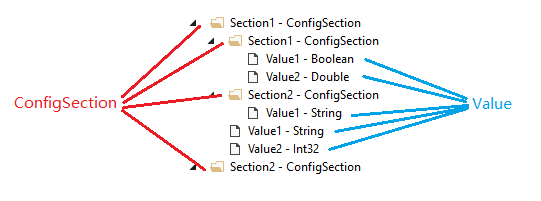
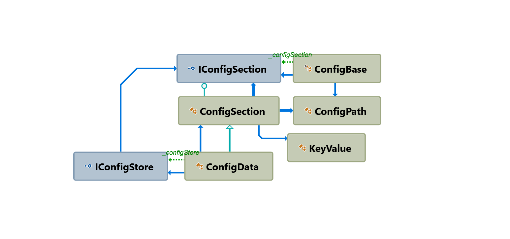

| Property     | Value          
|:-------------|:-----------------------
| Project Name | Configuration
| Author       | Liu Wan Li       
| Create Time  | 2019-04-09   


| Date         | Author     | Description         
|:-------------|:-----------|:-------------------------------------
| 2019-05-09   | Liu Wan Li | 重构配置参数模块，并更新文档


# Summary
该模块用来为处理配置信息提供支持
- 支持配置信息呈树状结构呈现
- 支持配置信息多种方式的持久化

# Concept
**ConfigSection**

ConfigSection 为配置资源的核心对象。一个 ConfigSection 就像一个目录，用来保存多个
由 ConfigSection 和 object 组成的集合。参数信息以 object 的形态，保存于 ConfigSection
的集合中。

**Value**

Value 用来保存参数的具体数据，可以为多种基础数据类型，例如 int double Guid DateTime等。
值以 object 的形式保存与配置参数中，调用者需要清楚的了解值的类型。通过以下方法读取值：
```C#
// 调用者需清楚的知道，返回的数据类型为 int，在调用时传入期待返回的值类型
var path = "Employee.Age";
int value = data.GetValue<int>(path);
```

> 原则上，Value 参数可以为任何类型，但是受限制于目前持久化的的设计，仅支持基础数据类型，例如 int string
> double float DateTime Guid 等。如果有需要，再扩充这部分功能。

从下图中可以看出，ConfigSection 就像 Windows 的目录，可以保存子 ConfigSection，亦可保存 Value。



**Path**

Path 为路径，用来读取或者写入配置文件提供查找的方式。例如上图中，通过
路径 Section1.Section2.Value1 可以获取到相应存储的值。

路径之间使用 "." 进行分隔，路径名称取名原则上考虑序列化目标的命名约束情况，
建议使用字母开头，可以包含字母和数字的一个字符串。

路径名有以下约束：
- 不得为 null 或者空字符串或者仅空格的字符串
- 大小写敏感
- 不得含有路径分隔符

# Usage

这部分介绍配置参数的两种读写方式、以及数据保存部分对象结构。

可以通过字典操作的方法，读写配置参数，也可以通过强类型的方法读写。

## 字典方式读写

调用者通过传入路径字符串读取或者写入值。

```C#
// 设置员工的年龄
data.SetValue<int>("Employee.Age", 30);

// 读取员工年龄时，第二个参数为默认值，当读取失败时，返回该默认值
int age   = data.GetValue<int>("Employee.Age", 0); // should return 30
int value = data.GetValue<int>("Employee.NewField", -1); // should return -1
```

> **注意**  
> 编译器可以通过参数类型，推断出 `data.SetValue<int>(path, age);` 的方法泛型类型，
> 因此直接写为`data.SetValue(path, age)`即可，后续代码我将省略泛型类型;

读写时也可以读取出一个Section，然后单独操作该Section读写方法，代码如下；

```C#
// 初始化一个含有一个 Employee 节点的配置对象
var root = new ConfigSection(rootSect =>
{
    rootSect.SetValue("Employee", new ConfigSection(employeeSection =>
    {
        employeeSection.SetValue("Name", "Nepton");
        employeeSection.SetValue("Sex", "M");
        employeeSection.SetValue("Age", 38);
        employeeSection.SetValue("DateOfJoin", new DateTime(2019, 2, 26));
    }));
});

// 读取 employee 节点
var employee = root.GetSection("Employee");
Assert.IsNotNull(employee);

// 通过使用 employee 读取,注意使用相对路径
string name = employee.GetValue("Name", ""); // should return "Nepton"
int    age  = employee.GetValue("Age", 0);   // should return 38
string sex  = employee.GetValue("Sex", "");  // should return "M"
```

## 强类型对象

### 定义

基于字典的读取方式灵活，但是可能出现由于路径拼写错误而无法正确读写内容的情况。可以定义配置文件对象，
通过强命名的方式读写配置信息，尽可能避免防止出现路径拼写错误的情况。使用强类型对象的步骤：
1. 创建一个配置文件类，继承于 ConfigBase
2. 重写 Path 属性，提供该对象读取配置参数的路径
3. 定义需要的参数，例如 LineWidth，调用基类的 GetValue 和 SetValue 读写配置属性

下边为演示代码
```C#
public class YourConfig : ConfigBase
{
    public YourConfig(IConfigSection configSection) : base(configSection) { }

    public override string Path => "GeometryEditor.Appearance";

    public int LineWidth
    {
        get => GetValue(1);
        set => SetValue(value);
    }
}
```

### 使用

使用 YourConfig 对象可以通过以下几种方式进行

1. 使用 Ioc 注入的方式，在构造函数处注入对象

```C#
public class YourClass
{
    private YourConfig _config; 

    public YourClass(YourConfig config)
    {
        _config = config;
    }

    public void YourMethod()
    {
        // 读取信息
        var lineWidth = _config.LineWidth;

        // 保存信息
        _config.LineWidth = 5;
    }
}
```

2. 通过创建对象的方式读写配置参数
```C#
public class YourClass
{
    public void YourMethod()
    {
        // 初始化  通过对象创建的方式创建 config 对象
        var configData = _resolver.Resolve<IConfigSection>();
        var config = new YourConfig(configData);

        // 读取信息
        var lineWidth = config.LineWidth;

        // 保存信息
        config.LineWidth = 5;
    }
}
```

3. 通过单件模式创建
```C#
public class YourClass
{
    public void YourMethod()
    {
        // 如果配置信息对象通过静态属性的方式创建了单件实例，通过该方法获取配置对象
        var config = YourConfig.Instance;

        // 读取信息
        var lineWidth = config.LineWidth;

        // 保存信息
        config.LineWidth = 5;
    }
}
```

## 实现持久化存储

IConfigStore 定义了配置参数持久化存储的接口，LoadAsync方法用来从持久化流读取数据；SaveAsync用
来把配置参数数据写入到持久化存储区；而SourceChanged用来监听持久化存储区是否由外界更改了数据内容。

```C#
public interface IConfigStore
{
    Task<ConfigSection> LoadAsync();

    Task SaveAsync(ConfigSection sections);

    event AsyncEventHandler SourceChanged;
}

```
> 目前 IConfigStore 没有针对IConfigSection，而针对实例类 ConfigSection

目前实现了 JSON 文件格式的持久化模块，具体参见项目 Configuration.Store.Json，使用方法如下：

```C#
var fileStream = new FileStreamProvider("config.json");
var jsonStore  = new JsonConfigStore(fileStream);

var configSection = await jsonStore.LoadAsync();
var employeeName  = configSection.GetValue("Employee.Name");
```

存储的数据按照对象的层级进行了格式化，开发人员或者部署人员可以通过第三方工具轻松的调整设置参数。

```JSON
{
  "Emplopyee": {
    "Name": "Nepton",
    "Sex" : "M"
  }
}
```

## 在项目中配置

ConfigData 继承于 ConfigSection，除了用来保存配置信息以外，ConfigData 引入了 IConfigStore，用来持久化保存配置参数
信息至磁盘、数据库等位置。

该对象可以以单件的方式，注册在Ioc中，并关联 IConfigSection 接口，强类型的对象注入时引用 ConfigData 对象，实现
全局数据的静态读写。

```c#
// 注册配置文件模块
var configFilePath = Path.Combine(
    AppDomain.CurrentDomain.BaseDirectory, "setting.json");

containerRegistry.RegisterInstance<IConfigStore>(
    new JsonConfigStore(new FileStreamProvider(configFilePath)));
containerRegistry.RegisterSingleton<IConfigSection, ConfigData>();
```

手动保存配置信息，如果要批量设置参数后，一次性保存，可以设置为手动保存配置信息，那么在适当的时候，请调
用 SaveAsync（或者相应同步方法）执行保存操作。
```C#
public class YourClass
{
    public async Task YourMethod()
    {
        var configData = _resolver.Resolve(ConfigData);
        await configData.SaveAsync();   // 或者 configData.Save(); 同步调用
    }
}
```

手动重新读取配置信息，如果外部配置信息改变，或者在手动保存模式下，想撤销内存的更改，调用
LoadAsync（或者相应同步方法）执行读取操作，当读取完成后，内存数据将丢失。

```C#
public class YourClass
{
    public async Task YourMethod()
    {
        // 调用Save函数立即保存
        var configData = _resolver.Resolve(ConfigData);
        await configData.LoadAsync();   // 或者 configData.Load(); 同步调用
    }
}
```

# Struction

下图是配置参数对象关系静态图：



- **IConfigSection**  
  接口 IConfigSection 声明了保存配置参数以及子 Section 的对象功能的函数声明，具体实现类为 ConfigSection

- **ConfigSection**  
  接口 IConfigSection 的默认实现版本

- **ConfigData**  
  继承于 ConfigSection，在基类的基础上扩展并提供了持久化存储的功能，与接口 IConfigStore 建立了关系。

- **IConfigStore**  
  接口 IConfigStore 声明了一个持久化存储对象如何把 IConfigSection 进行存储，以及如何读取存储数据并生成 IConfigSection 的对象。

- **ConfigBase**  
  ConfigBase 类包装了 IConfigSection，并提供一套机制让开发者实现强类型检查的配置参数对象。

- **ConfigPath**  
  这是一个辅助类，负责处理路径解析，例如 Employee.Age 这样的配置参数查询路径的解析工作由 ConfigPath 处理

> Notice  
> 其他类仅负责处理周边的代码和功能，不一一详细描述
